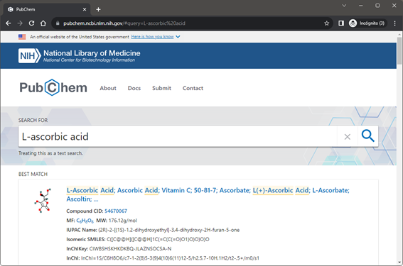

# Using InChI and InChIKey to annotate your chemical entities 

```{dropdown} About this interactive  recipe
- Author: [Jordi Cuadros](https://orcid.org/0000-0001-6513-9140)
- Reviewer:
- Topics: InChI, InChIKey
- Format: Tutorial
- Scenarios: Retrieve the InChI and InChIKey of a chemical
- Skills:
    - Understand what an InChI is (<http://publications.iupac.org/ci/2006/2806/2806-pp12-15.pdf>, <https://www.inchi-trust.org/>)
    - Know what MOL files are and where to get them (<https://en.wikipedia.org/wiki/Chemical_table_file>, <https://discover.3ds.com/sites/default/files/2020-08/biovia_ctfileformats_2020.pdf> )
    - Understand what a SMILES string is (<https://en.wikipedia.org/wiki/Simplified_molecular-input_line-entry_system>, <http://opensmiles.org/>)
- Learning outcomes: After completing this example you should understand:
    - What makes InChI and InChIKey convenient identifier for chemical
    - How to obtain the InChI and the InChIKey of a chemical
    - How to identify a chemical behind an InChI or an InChIKey
- Citation: 'Using InChI and InChIKey to annotate your chemical entities', The IUPAC FAIR Chemistry Cookbook, https://iupac.github.io/WFChemCookbook/recipes/rec_using_inchi.html
- Reuse: This notebook is made available under a [CC-BY-4.0](https://creativecommons.org/licenses/by/4.0/) license.
```

## Scenario

So far, we are quite used to identifying chemical substances with a name, a drawing or a CAS Registry Number (CAS-RN). However, these identifiers have some issues that affect their usability for indexing and searching. A way to increase the FAIRness of our documents is to annotate our chemicals with InChI and InChiKeys, either in papers, data, or metadata files.

Let's do it together!

## Case 1: I can draw my chemical 

Many molecular drawing packages like ChemDraw, <https://revvitysignals.com/products/research/chemdraw>, ChemSketch, <https://www.acdlabs.com/products/chemsketch/>, or MarvinSketch, <https://chemaxon.com/marvin>, can output the InChI and the InChIKey for a molecule drawn on them.


Alternatively, we can use the CACTUS Chemical Identifier Resolver, <https://cactus.nci.nih.gov/chemical/structure> to get the InChI or the InChIKey of a drawn chemical.


## Case 2: I can unambiguously name my chemical 

If we can name our chemical (and this name is included in the chemical databases), you can use PubChem or ChemSpider searching features, or the CACTUS Chemical Identifier Resolver, <https://cactus.nci.nih.gov/chemical/structure>, to obtain the InChI or the InChIKey.



If you can name the compound according to IUPAC systematic nomenclature, you can use the Open Parser for Systematic IUPAC nomenclature (OPSIN), to calculate (this is not a search) the InChI and the InChiKey. OPSIN can be downloaded (accessed on the command line) or used online at <https://opsin.ch.cam.ac.uk/index.html>.


## Case 3: I have a MOL file for my chemical

If you have a MOL or SDF file for our molecule, you can use the UniChem service, <https://www.ebi.ac.uk/unichem/> to upload the file and obtain its InChI and InChIKey.

You can also use the following software that you install locally to process the MOL file:

-   InChI core software, <https://www.inchi-trust.org/download-latest-inchi-standard-software/>.
-   OpenBabel, <https://openbabel.org/wiki/Main_Page>,

to convert a MOL file to InChI or InChIKey.

Many common molecular drawing programs can also export and import MOL files. This way. they can also be used to convert a MOL file to an InChI or InChIKey. Make sure to check that isotope and stereochemistry information is preserved when importing and exporting MOL files.

## Case 3: I have the SMILES string or the InChI for my chemical

In the case you are able to write our chemical as a SMILES string or already have an InChI and just need the InChIKey for it, we may use the CACTUS Chemical Identifier Resolver, <https://cactus.nci.nih.gov/chemical/structure>.


Please be aware that complex InChIs can not be interpreted by the CACTUS Chemical Identifier Resolver.

Again, import and export features of the common molecular drawing packages may be useful in this case. Last but not least, databases can also help find an InChI or an InChIKey from a SMILES; provided the compound is included in the database. Remember to check the responses before taking them as correct (specially for stereochemistry and isotope distribution).

## Case 4: I only have the CAS-RN for my chemical

If you only have the CAS-RN for your chemical, you have to resort to a database to potentially find the InChI and InChIKey. Curated chemical databases, such as the ACS Common Chemistry service, <https://commonchemistry.cas.org/> (for common chemicals) or SciFinder, <https://scifinder.cas.org>, will be among the first options to try. Other databases like PubChem, <https://pubchem.ncbi.nlm.nih.gov>, ChemSpider, <https://chemspider.com>, Wikidata, <https://www.wikidata.org/>, or Wikipedia, <https://www.wikipedia.org/>, (quote your CAS-RN) may also work in many cases for common chemicals.


## Last step: Let's check our InChI and InChIKey

Once you have found the InChI and the InChIKey of a chemical species, it may be worth to double-check what we got as a result.

### Quick checks

Let's start with some simple checks.

- Does the InChI starts with the expected characters, "InChI=1S/"?
- Does the InChI have the expected layers, e.g., t, m , s sublayers if you are referring to a specific isomer, or i if you have an isotopically -labelled compound?
- Does the InChIKey have 27 characters?
- Does it follow the expected structure 14 uppercase letters, a hyphen, 10 uppercase letters, a hyphen and one last uppercase letter?
- Does it end with N if the chemical specie is neutral?
- Does the InChIKey has SA has the last two letters preceding the second dash? (SA there means version 1 standard)

### Import your InChI into a molecular drawing tool

You can use your preferred molecular drawing tool to import the InChI and check that the response corresponds to your chemical structure. The drawing tool at UniChem, <https://www.ebi.ac.uk/unichem/>, may well serve this purpose.


### Google it!

Major web search engines, like Google, Bing or Baidu can search from an InChIKey; its structure is largely specific and allows finding references and data related to your chemical specie. So, search your InChIKey and make sure you get back responses that belong to your molecule.

### Use an InChI resolver

Last, specific tools are being developed to resolve InChI and InChIKey by searching into databases. Currently, InChI and InChIKey resolution can be done at PubChem search page, <https://pubchem.ncbi.nlm.nih.gov/>, UniChem, <https://www.ebi.ac.uk/unichem/> or the CACTUS Chemical Identity Resolver, <https://cactus.nci.nih.gov/chemical/structure>.

API to resolve programmatically InChIKeys are also being developed. Progress can be checked out at <https://inchi-resolver.org/>.
