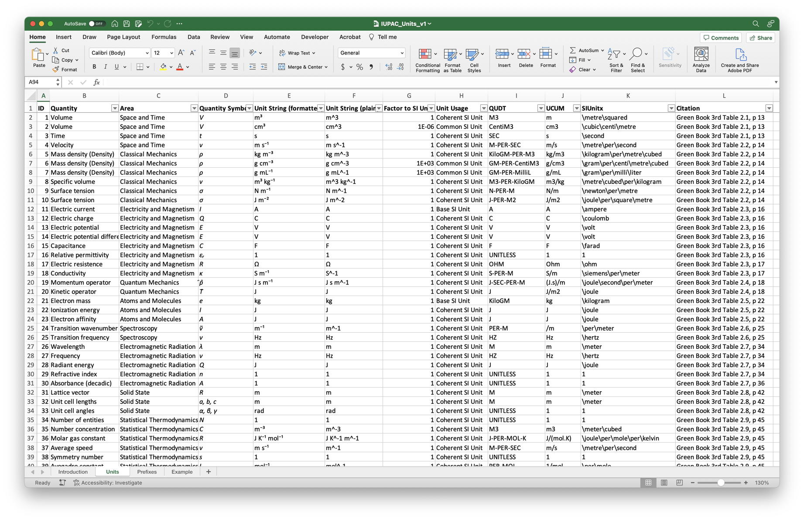
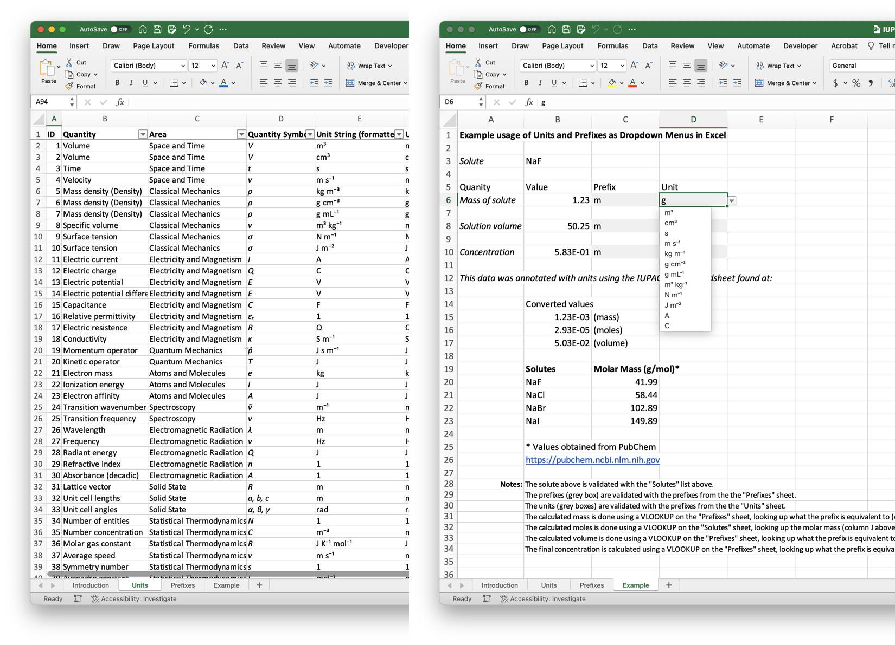

# Data Interoperability through Standardized Units of Measurement

```{dropdown} About this technique
- Author: [Stuart Chalk](https://orcid.org/0000-0002-0703-7776)
- Reviewer:
- Topics: Units of Measurement, Controlled Vocabulary, Validation in Excel
- Format: Markdown file
- Scenarios: Working up data for publication
- Skills: You should be familiar with
    - [SI Units of Measurement](https://www.bipm.org/en/measurement-units)
    - [Controlled vocabularies](https://en.wikipedia.org/wiki/Controlled_vocabulary)
    - [Functions in Microsoft Excel](https://support.microsoft.com/en-au/office/excel-functions-by-category-5f91f4e9-7b42-46d2-9bd1-63f26a86c0eb)
- Learning outcomes: After reading about this technique you should:
    - Understand how to digitally annotate data with units.
    - Appreciate how storing units digitally enables interoperability and promotes data reuse.
    - Using Excel (and CSV) as a supplemental information file format.
- Citation: 
- Reuse: This notebook is made available under a [CC-BY-4.0](https://creativecommons.org/licenses/by/4.0/) license.
```

## Improving Supplemental Information
It has become obvious that publishing data with a research paper should no longer be done using the PDF file format.
Conversion of data from Excel, Word, SASS, etc., to PDF makes it almost impossible to extract the data and in addition
understand what data values are in terms of the quantity and unit.  To enable interoperability in science we must
publish our data in a way that makes it easy to accurately interpret and subsequently reuse, while making this process
easy to implement in research workflows. This technique describes is a low barrier way to improve the quality of data 
reported as supplemental information and for research data archiving in general.

## Improving data quality through standardized unit representation
Most scientists use the International System of Units (SI) and for the most part it is the 'easiest' part of doing research.
However, because it is easy it is often not appreciated how important it is.  In the context of digital data, it is
especially important for computers to be able to interpret data, especially if we expect them to do "calculations for us" 
in any accurate and reliable way. {cite:p}`Hanisch2022`

There are many ways in which researchers represent units as they work up their data.  It can be part of the header of
a column, appended to numeric values as a string, or in some situations implied by the quantity being measured.  The
common thread here is that units are not usually explicitly (separately) reported and that makes them difficult to deal
with digitally.  In addition, in many situations a unit is not written in accordance to published guidelines, which in 
chemistry is the IUPAC "Quantities, Units and Symbols in Physical Chemistry" (or The IUPAC Green Book). {cite:p}`Green2007`

There is a lot of information in the exhaustive tables in the Green Book, and it covers, not surprisingly, a wide 
range of quantities and units across the many sub-disciplines of chemistry. As a guide for humans to read it's fine but
enabling practical usage in the digital laboratory it is not, where units are almost an afterthought (IUPAC is working
on a digital version of the Green Book as you read this.)  So, enabling the use of IUPAC recommended units in chemistry
has been reimagined in this [Excel spreadsheet](../files/tec_iupac_units_excel.xlsx).

## Using the IUPAC Units Spreadsheet
The spreadsheet has been developed to provide the most common quantities and units expressed in the Green Book along 
with additional columns that characterise each unit and representations in some different encodings of units of 
measurement (see the figure below).  The spreadsheet will be expanded with quantities and units over time and if you
would like to help with its development, please let the author know ([schalk@unf.edu](mailto:schalk@unf.edu).



Making units of measurement available in this spreadsheet enables it to be used to support many researchers.  In fact,
as the representations are standardized, annotating the data with units can be considered as using a "controlled 
vocabulary" for units.  This, plus a statement in the research data Excel file that the units were annotated using the
IUPAC Units Spreadsheet (with a link and version #) enables others to be able to interpret the data correctly.

To use the spreadsheet researchers either include the units and prefixes sheets in their data spreadsheet, OR reference
to the spreadsheet when they add the units/prefixes to their data spreadsheet (in this case the location of the IUPAC
Units spreadsheet should be constant).  Then, using the validation function in Excel, cells in the data spreadsheet that
should contain units (or prefixes) are validated (using the Validation menu item under the Data menu) against the list 
of units (see the spreadsheet for the detailed function). Then, when a user goes to each unit/prefix cell they get a 
dropdown menu of choices (see figure below).



The "Example" sheet above, included in the IUPAC Units spreadsheet, demonstrates how to use the unit and prefix lists
to validate the content of cells. It also uses the VLOOKUP function to then lookup values for the molar masses and the
factors associated with the prefixes.  This enables the calculation performed in the sheet such that changing the solute 
and the numeric values for the mass and volume, the final concentration can be calculated.

```{note} Challenge!
The way that the IUPAC Units spreadsheet is used in the "Example" sheet assumes that the user knows what units are valid
for a particular quantity.  However, this many not always be true especially if the data is being reused by another
researcher.  How could the "Example" sheet be upgraded to make the choices available for units based on the quantity?
```

## Future directions for this functionality
As mentioned above, IUPAC is currently working on a project to produce a digital version of the Green Book (this
resource with be updated to include this when it is available).  In addition, potentially a better (but more technical)
solution would be to develop an [Excel Add-in](https://learn.microsoft.com/en-us/office/dev/add-ins/develop/develop-overview) 
for this functionality that draws data from the digital version of the Green Book content.