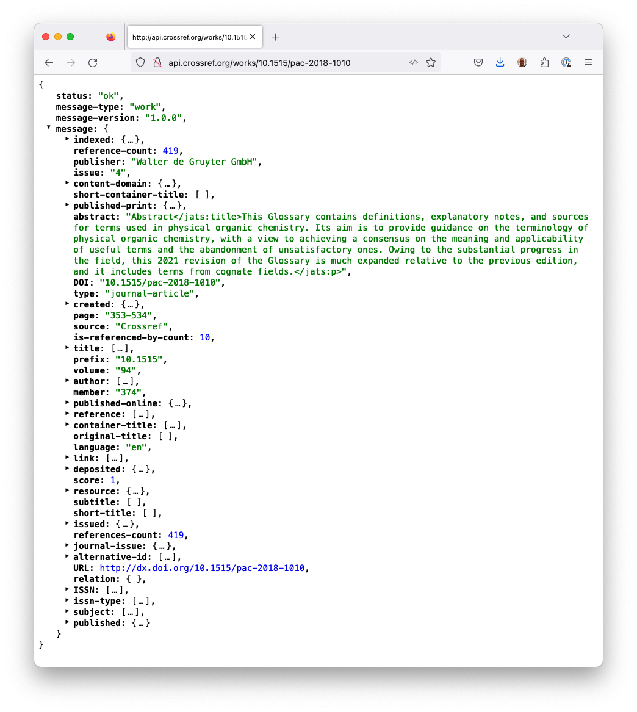

# Importing JSON Citation Data from an API into Google Sheets 

```{dropdown} About this recipe
- Author: [Stuart Chalk](https://orcid.org/0000-0001-6513-9140)
- Topics: Data Importing, Google Sheets, Citation data
- Format: Markdown file, Google Sheets file
- Skills: You should be familiar with
    - [Google Sheets](https://www.youtube.com/watch?v=FIkZ1sPmKNw&t=12s)
    - [JSON](https://www.youtube.com/watch?v=iiADhChRriM)
    - [Crossref API](https://api.crossref.org)
- Learning outcomes:  After completing this example you should understand:
    - Options to import data into Google Sheets
    - Understand how to configure the Google Sheets document to import .json files
    - Usage of the ImportJSON Apps Script 
- Citation: 'Importing JSON Citation Data from an API into Google Sheets', Stuart Chalk, The IUPAC FAIR Chemistry Cookbook, 
  Contributed: 2024-02-14 [https://w3id.org/ifcc/IFCC015](https://w3id.org/ifcc/IFCC015).
- Reuse: This notebook is made available under a [CC-BY-4.0](https://creativecommons.org/licenses/by/4.0/) license.
```

## Summary
In many research contexts access to the literature is very important and dealing with its metadata can be time-consuming.
The advent of the [Digital Object Identifier](https://www.doi.org/) (DOI) has made it much easier to deal with 
citation data for many different types of digital resources.  Currently, twelve 
[registration agencies](https://www.doi.org/the-community/existing-registration-agencies/) are 'minting' (creating) 
DOI's and each has a different scope and size.  From a research literature perspective 
[CrossRef](https://www.crossref.org/) is the agency that holds DOI's (now  
[~150,000,000](https://www.crossref.org/06members/53status.html)) and that is a lot of data to sort through.

This tutorial therefore focuses on understanding how you can pull in citation metadata from the CrossRef API, and 
load it in a Google Sheet, to make it easy (for instance) to create a citation string for a paper.  An example of a
sheet that does this is available [here](https://docs.google.com/spreadsheets/d/1tvU1p4zZBHgiAl1IFZHerh7_yqrn_Vn5nLIV9FcAz_0/edit#gid=0), 
and you can make a copy and play around with it. Exploring what it takes to put the data into the document is a great
way to understand the CrossRef schema, the structure of how the data is provided.

## 1 Accessing the CrossRef API
The CrossRef API makes available metadata about journal papers, books and other publication types.  Detailed documentation
of the API is available at main URL endpoint, https://api.crossref.org.  This is too big to go over in this tutorial, so
we will just be focusing on the 'works' endpoint (a partial URL that you can add a DOI to) - in this case
https://api.crossref.org/works/.  If you append a DOI to the end of this partial URL and put it in a browser you will 
get a JSON file returned (see below).  The JSON file is formatted using the [JSONView](https://jsonview.com/) 
plugin for Firefox and all the fields have been collapsed to make it easy to see the whole file at
http://api.crossref.org/works/10.1515/pac-2018-1010.



Caption: JSON output from the Crossref API

The data we need to extra to be able to criteria a citation for this paper is spread throughoout different parts of the
JSON file, so we need to know how to get to these metadata. You can think about accessing information in the JSON file
by using the concept of 'paths' to the data elements. This is the same as the path to a file on your computer, going
down into subdirectories until you reach the file. In this case data we need are at the following paths and

