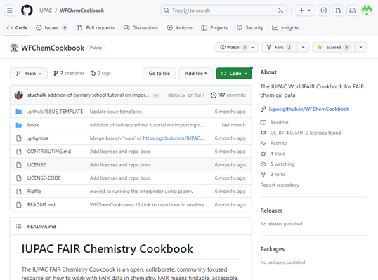
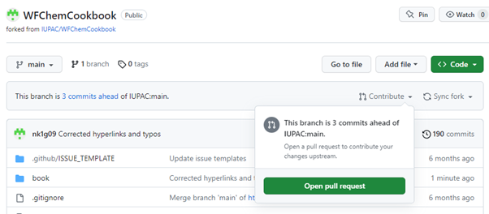
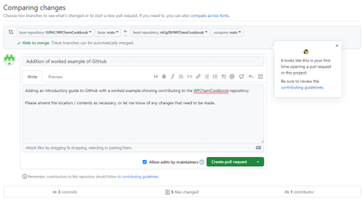

# Introduction to GitHub and Version Control – the WorldFAIR cookbook worked example

About this tutorial:
Topics: Github, version control
Learning outcomes: After working through this tutorial you should understand:
-	The key concepts of version control
-	How to work with an existing code repository
-	How to contribute code to the WorldFAIR repository. 

Whether you're a software developer or an organic chemist, version control can be a really useful tool for organising, storing and documenting your work, whether this is on a collaborative project or working on your own. This tutorial will introduce the world of version control and the widely-used platform GitHub, through a worked example of the WorldFAIR cookbook.  
Examples in this tutorial use the windows GitHub desktop app, although it is possible to work with GitHub on other operating systems, directly through the command line, or through some code editing programs. 

## What is Version Control?
Version control is a system that tracks changes made to files over time. It allows multiple people to collaborate on a project simultaneously, keeping track of who made what changes and when. Additionally, it maintains a history of changes, making it easy to revert to previous versions if needed. An element of version control is now included in many products such as google docs, dropbox or Microsoft office, where you can see version history of a document or track changes that are made in a document. There are multiple different complete version control systems (VCS), in this tutorial we will only be working with GitHub.

## Key Benefits of Version Control
1.	**History Tracking:** Every change is tracked, allowing you to see who made the change and why.
2.	**Collaboration:** Multiple developers can work on the same project simultaneously without conflicts while working. 
3.	**Branching:** Create separate branches to work on new features or fixes without affecting the main codebase.
4.	**Backup and Recovery:** Easily revert to a previous working version in case of errors or issues.

## Introducing GitHub
GitHub is a web-based platform built around the concept of version control using Git, a distributed version control system. It provides a user-friendly interface for managing repositories (collections of files and their history) and collaborating with others. It's particularly popular among developers for hosting their code repositories and collaborating with others but can be used by anyone.  

We will work through an example using the WorldFAIR cookbook repository, but if you want more information about GitHub then check out their [GitHub Docs](https://docs.github.com/en) and [learning resources](https://docs.github.com/en/get-started/quickstart/git-and-github-learning-resources).

### Key GitHub Concepts:
1.	**Repository (Repo)**: This is where your project lives, it contains code, other files, folders, and their history. Repositories can be public (visible to everyone) or private (restricted access).
2.	**Clone**: Creating a copy of a repository on your local machine is called "cloning". This allows you to work on the code locally and then sync your changes back to the GitHub repository.
3.	**Branch**: A branch is a separate line in the repository. It allows you to work on features or fixes without affecting the main codebase. The "main" branch typically represents the stable version of the project, and other branches can be used for development.
4.	**Fork**: Forking a repository creates a copy of the repository in your GitHub account. It allows you to experiment with changes without affecting the original project.
5.	**Commit**: A commit is a saved change to your project's files. Each commit has a unique identifier and is accompanied by a message describing the changes. A commit can include edits to more than one file. 
6.	**Pull Request (PR)**: When you've made changes in a branch and want to merge them into the main codebase, you create a pull request. Others can review the changes before merging.
7.	**Merge**: Merging combines changes from one branch into another. Pull requests are often merged after review.
8.	**Markdown**: Markdown is a simple text formatting language used to style documents and web content. It uses symbols (such as '#'. '*', '-') for basic formatting of text. 

## GitHub Worked Example:

### 1. Create a GitHub Account:
First, you need to create a GitHub account (or log in if you already have an account). Go to https://github.com and click on the "Sign Up" button. Follow the steps to create your account, choose a username, and set a strong password. Once you have completed the sign-up process, you will have your own GitHub profile.

### 2. Find Repositories:
You can browse public repositories to see how projects are organized and structured, many public repositories will also allow contributions to be made to them. If the repository you want to work on is private you will need to be invited to join it. In this example we will be looking at the public WorldFAIR cookbook repository https://github.com/IUPAC/WFChemCookbook
-	When you open the repo you will see the structure of the files / folders in the repo and a README file for the repo (if present) which should explain a bit about the project and how to work with it. 
-	You can navigate through the files to see the content present in the cookbook repository. Many of the files are .md which is the Markdown format. 
-	The [Cookbook website](https://iupac.github.io/WFChemCookbook/intro.html) is the best place to interact with the actual content, but if you want to contribute to the content or suggest an edit then this would be done through GitHub. Note: if you aren’t confident with GitHub / markdown but want to highlight an issue then you can [submit an issue](https://github.com/IUPAC/WFChemCookbook/issues/new/choose) to the repository. 

### 3. Fork the Repository: 
Now we are going to make some changes to the content on the CookBook. To do this we will make a fork of the repository to work on so we are not changing any of the content on the stable ‘main’ branch.
-	To fork a repository click the fork button in the top right of the main repository page. 
-	You can change the name / description but most of the time this will be unnecessary and you can just click create fork. 
-	This will create a copy of the repository in your own GitHub profile where you can work on it. 

### 4. Open GitHub Desktop: 
Ensure you have a GitHub client installed on your machine. [GitHub Desktop](https://desktop.github.com/) is one option, [Git for Windows](https://git-scm.com/download/win) is another option that can be used in certain code editors such as VS Code. These have installers available and you can leave any options as the default settings.

Once this is installed, open the program and sign in to your GitHub account. You will need to authorise the application to access your GitHub data. 

### 5. Clone the Repository: 
Now we want to make the files available on our local machine so we can work on them. To clone the repository to your machine you can go to File > Clone Repository. In the repository URL you enter the URL of the forked repository this will most likely be https://github.com/yourusername/WFChemCookbook and you set the local folder where you want to work on the files. 

-	You will have set up options asking you if you are planning on contributing to the parent project or working on your own. This will set some of the parameters in GitHub Desktop. For this project select ‘To contribute to the parent project’
-	Once this has cloned the repository you will see the files available in your file explorer (in the location set in local path) and be able to interact with them. 

### 6. Make changes and commit these:
Now you can start working on some changes to the code / files in the project. You will need to locate the files. You can either open these in an external editor (Ctrl + Shift + A from GitHub desktop), open in file explorer (Ctrl + Shift + F in GitHub desktop) or navigate to them in your file explorer. 

**Tips for making changes:**
•	You can create new files, edit existing files, or even delete content that is already in the repository. When contributing to an existing repository you should ensure you follow the existing file/folder structure when creating new files. E.g. if you are working on a new sample recipe then this should be located under ‘samples’. 
•	If you are unsure about where something should go then discuss this with the repository owners through the discussions area on the original repository. 
•	Any changes you make will only be on your local machine, until you commit them and push them back up to the repository on GitHub. 
•	Once you have made changes locally you can make a commit and this creates a ‘save’ point in the project. Each commit should have a message alongside it to ensure someone can understand the change. Due to this it is best to make your commits smaller chunks of related changes rather than saving up lots of different changes and committing them all in one go. 

Open a file (or create a new file) you wish to change in your preferred code editor. Many of the files in the cookbook are either Jupyter Notebooks (.ipynb) or Markdown (.md). The basic syntax of Markdown can be seen [in this guide](https://www.markdownguide.org/basic-syntax). 
Make changes to the content and save these changes. Note: this will not yet have any affect on the GitHub repository. 

### 7. Committing the changes:
If you open GitHub desktop now you should see a number of changes to files that you have created, edited or deleted. For each of these files it will show a ‘diff’ which will show the difference between the version in the repository and your changed files. 

If you have changed some files by accident, or don’t want to include all the changes in a single commit you can deselect some of the files in the changes window. Then you need to enter a ‘summary’ for the commit – this is the commit message. You can also add a more detailed description, although this is not required. 
Then click ‘Commit to *branch name*’, this will make a ‘commit’ to your local copy of the repository. 

### 8. Push the changes to the remote repository:
To make these changes available to other people you will need to then push them up to the remote repository. 
Once pushed to origin you will be able to see the changes by viewing the repository on github.com. You will see a message saying this branch is x commits ahead of IUPAC:main this means there are changes on your repository that are not on the original project.
It may also show your branch as behind IUPAC:main if changes have been made to the original project. 

### 9. Create a Pull Request:
Once you have finished all of the changes you wish to make and are ready to request that your changes are incorporated into the original project it’s time to open a pull request. 
-	Navigate to your fork of the repository on github.com (make sure all changes have been committed and pushed from your local version and that you are viewing the most up to date commit). 
-	Make sure you are on the correct branch that you have been working on (this will be main if you have followed this tutorial)
-	Click the ‘Contribute’ button in the message bar and you will see an option to ‘Open pull request’

-	This will compare the two branches and determine if they can be merged automatically, or if there are any conflicts to resolve. Conflicts usually arise if changes have been made to the same files on both branches. 
-	The summary will show which branches are being merged, how many commits you are merging, and the number of files being changed. 
-	Add a title describing the pull request and in the description field put an explanation of the content you are asking to be added. This will be seen by the repository maintainers and help them to review your pull request. 

-	Once you have created the pull request this will go into review before it is merged into the main repository. 
-	The maintainers may ask for some clarification or further changes to be made before they merge the code. 
-   Once the is merged it will be available for others to see, modify and further collaborate on.
-   Thank you for contributing to the WFChemCookBook! 

This introduction scratches the surface of GitHub and version control. There are many more features available as you get more familiar with using Git in your workflow.